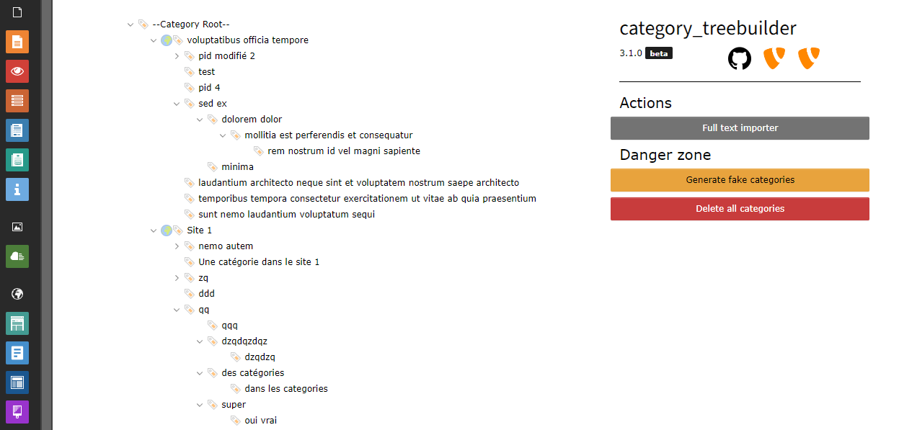

# Category Tree Builder
Build and manage easily your category tree.

## Install

> :warning: Do not install this extension in production environment ! :warning: <br>
> This extension is still under development, it might ruin your category folder structure or delete all your categories<br>
> Install at your own risks

### Manual install
1. Download the extension.
2. Put the extension in a root folder of your TYPO3 site. ex. `/packages`
3. In your root `composer.json` add the following
```json
	"repositories": [
		{
			"type": "path",
			"url": "packages/*"
		}
	],
```
4. Run the command `composer req petitglacon/category-treebuilder:@dev`
5. You'll find the module under admin tab
6. Enjoy

## Features
- Category "CRUD" : create, update, delete your categories at will with contextual menu
- Move entire category subtree in a simple drag and drop
- LocalStorage keeps track of open/closed subtrees
- Generate fake categories

## Roadmap
- Translations 
- Folders handling

### Open source
Don't hesitate to open issue for feature request or bugs

## Versions
See version changelog in changelog.md

## Screenshots
### Backend module

### Contextual menu

### Create/Update Modal

### Full text importer


## Dev
### Build
You'll need to build the Vue app to modify the backend module<br/>
To do that open a CLI in `packages/category_treebuilder/Resources/Private/JavaScript/vue`<br/>
Install node modules `npm i` (or with ddev `ddev npm i`)<br/>
Next run `npm run dev` (or with ddev `ddev npm run dev`)<br/>

## Infos
This extension has been built for the [Typo3](https://typo3.fr/) project, [see on TER](https://extensions.typo3.org/extension/category_treebuilder)
